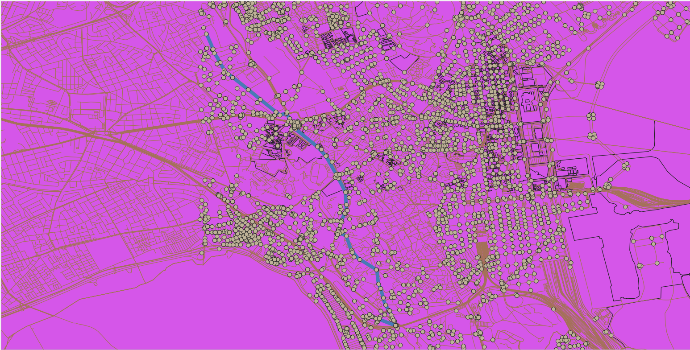
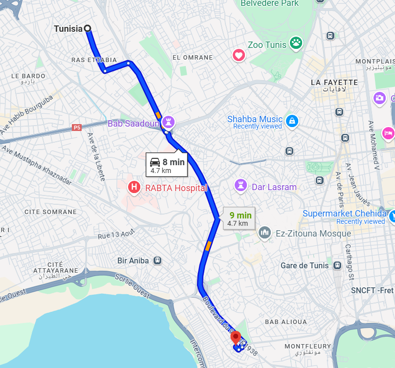

# Dijkstra Implementation

This project implements Dijkstra's algorithm to find the shortest path between two points in a road network. It leverages data from OpenStreetMap (OSM) to model the road network and uses PostgreSQL with PostGIS to store and query the network's edges. The main aim of the project is to compute the shortest path efficiently and visualize it using QGIS.

### Project Overview

The project consists of a Python-based implementation of Dijkstra’s algorithm using a road network stored in a PostgreSQL database with the PostGIS extension. The road network data is downloaded using the `osmnx` library, which retrieves OSM data for a given location and stores it in a database. The shortest path is then calculated between two points in the network using the algorithm.

The result is stored in a new table, `shortest_path`, which holds the geometry of the computed path as a `LINESTRING`. This allows for easy visualization and further analysis using geographic information systems (GIS).

### Comparison with Google Maps

To evaluate the performance and accuracy of our Dijkstra implementation, we compared the results with Google Maps, a widely-used navigation system. Below are the key observations:

1. **Path Accuracy**:
   - **Dijkstra Implementation**: Our implementation calculates the shortest path based on the road network data from OpenStreetMap. The path is determined purely by the shortest distance, without considering real-time traffic or road conditions.
   - **Google Maps**: Google Maps uses a more sophisticated algorithm that incorporates real-time traffic data, road closures, and other dynamic factors. As a result, the path suggested by Google Maps may differ from ours, especially in urban areas with heavy traffic.

2. **Performance**:
   - **Dijkstra Implementation**: The performance of our implementation depends on the size of the road network and the efficiency of the algorithm. For large networks, the computation time can increase significantly.
   - **Google Maps**: Google Maps leverages cloud computing and advanced algorithms to provide near-instantaneous results, even for large networks.

3. **Visualization**:
   - **Dijkstra Implementation**: The shortest path is visualized using QGIS, which provides detailed geographic context but requires manual setup and configuration.
   - **Google Maps**: Google Maps offers an intuitive and user-friendly interface for visualizing routes, complete with turn-by-turn directions and real-time updates.

Below are two images comparing the results of our Dijkstra implementation with Google Maps:

- **Image 1**: Shortest path calculated by our Dijkstra implementation, visualized in QGIS.
- **Image 2**: Route suggested by Google Maps for the same start and end points.

  
*Shortest path calculated by our Dijkstra implementation.*

  
*Route suggested by Google Maps.*

### Tools Used

- **osmnx**: A Python package used to download and work with OpenStreetMap data. It is used to retrieve the road network data for the area of interest and store it in a suitable format for analysis.
  
- **PostgreSQL + PostGIS**: PostgreSQL is a powerful relational database system, and PostGIS is a spatial database extender for PostgreSQL that enables GIS operations. It is used to store the road network, including node coordinates and edge lengths, and for efficient querying during the shortest path computation.

- **QGIS**: A popular open-source geographic information system (GIS) used for visualizing, analyzing, and editing spatial data. QGIS can be used to visualize the road network and the shortest path calculated by the project.

### Files in the Project

- `dijkstra.py`: Implements the Dijkstra algorithm to compute the shortest path between two nodes.
- `download.py`: Downloads the road network data for a specified area using the `osmnx` library and saves it in a GeoPackage format.
- `shortest.py`: Fetches road network data from the PostgreSQL/PostGIS database, runs Dijkstra's algorithm, and stores the resulting shortest path in the database.
- `environment.yml`: Contains the list of dependencies for the project, including the necessary libraries and packages.

### Installation

1. Clone the repository:

   ```bash
   git clone https://github.com/ahmedessouaied/DIJKSTRA-IMPLEMENTATION.git
   cd <repository-directory>
   ```
2. Set up your Python environment using Conda:
   ```bash
   conda env create -f environment.yml
   conda activate env
   ```
3. Set up PostgreSQL and PostGIS, ensuring you have the required schema and tables for storing road network data.

4. Install QGIS for visualizing the results.

### Usage

1. **Download the Road Network**: Run `download.py` to download the road network for a specified location and store it in a GeoPackage.

2. **Compute the Shortest Path**: Use `shortest.py` to run the shortest path calculation between two points in the road network. The result will be stored in a shortest_path table in the PostgreSQL database.

3. **Visualization**: Load the GeoPackage file into QGIS to visualize the road network and the computed shortest path.

### Notes

- Ensure that you have access to a PostgreSQL instance with the PostGIS extension enabled.
- The road network data can be quite large, so make sure your system has sufficient resources for downloading and processing the data.